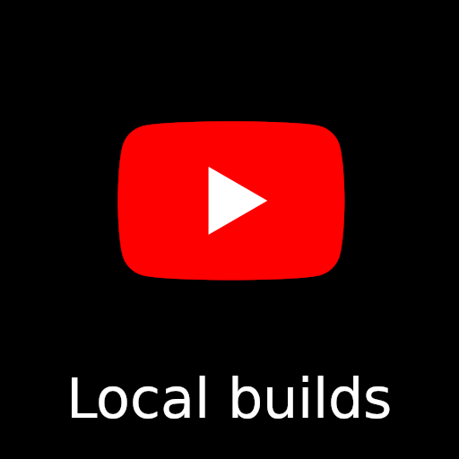

# WebFX 

WebFX lets you write applications for all major platforms (Web, Mobiles & Desktops) from a single Java code base.

## Graphical demos

<table>
<tr>
<td align="center" valign="bottom"><a href="https://tallycounter.webfx.dev"> Tally Counter</a> 
</td>
<td align="center" valign="bottom"><a href="https://moderngauge.webfx.dev"> Modern Gauge</a> </td>
<td align="center" valign="bottom"><a href="https://enzoclocks.webfx.dev">   Enzo Clocks</a> </td>
<td align="center" valign="bottom"><a href="https://spacefx.webfx.dev"> SpaceFX</a> ♪ </td>
</tr>
<tr>
<td align="center" valign="bottom"><a href="https://demofx.webfx.dev"> DemoFX</a> ♪ </td>
<td align="center" valign="bottom"><a href="https://raytracer.webfx.dev"> Ray Tracer</a> </td>
<td align="center" valign="bottom"><a href="https://mandelbrot.webfx.dev"> Mandelbrot</a> </td>
<td align="center" valign="bottom"><a href="https://fx2048.webfx.dev"> FX2048</a> </td>
</tr>
<tr>
<td colspan="4" align="center">

</td>
</tr>
</table>

## Enterprise demo (coming soon)

[Modality](https://github.com/modalityone/modality) is the first real-world Enterprise-level WebFX application in development. Here are a few wireframes of the back-office (WebFX will provide all the components required for these UIs):

<table>
<tr>
<td></td>
<td></td>
<td></td>
<td></td>
</tr>
<tr>
<td></td>
<td></td>
<td></td>
<td></td>
</tr>
<tr>
<td></td>
<td></td>
<td></td>
<td></td>
</tr>
</table>

## Fully cross-platform

WebFX applications can be compiled and run on 7 different platforms, from a unique source code base.

<table>
<tr>
<td></td>
<td>
    <picture>
      <source media="(prefers-color-scheme: dark)" srcset="apple-dark.svg">
        
    </picture>
</td>
<td>
    <picture>
      <source media="(prefers-color-scheme: dark)" srcset="linux-dark.svg">
        
    </picture>
</td>
<td></td>
<td></td>
<td></td>
<td></td>
</tr>
</table>

| Platform                                    |          32-bit JRE           |          64-bit JRE           |         64-bit Native         |
|---------------------------------------------|:-----------------------------:|:-----------------------------:|:-----------------------------:|
| Desktops (Windows, macOS & Linux)           |               ✅               |               ✅               |               ✅               |
| Tablets & mobiles (Android & iOS)           |               ❌               |               ❌               |               ✅               |
| Embed (Raspberry Pi) ~ *not yet documented* |               ✅               |               ✅               |               ✅               |
| Web (Chrome, FireFox, Edge, etc...)         |  |  |  |

## How it works

JavaFX is used as UI toolkit. JavaFX can already be compiled for Desktops, Mobiles & Embed. WebFX is here to add the Web platform to this collection. 

    <picture>
      <source media="(prefers-color-scheme: dark)" srcset="https://docs.webfx.dev/webfx-readmes/webfx-cross-platform-dark.svg">
        
    </picture>

WebFX achieves this by providing the WebFX Kit - a GWT compatible version of OpenJFX - making your application compilable to a Web App with [GWT][gwt-website]. For more explanation, please read the [documentation][webfx-docs].

    <picture>
      <source media="(prefers-color-scheme: dark)" srcset="https://docs.webfx.dev/webfx-readmes/webfx-kit-dark.svg">
      
    </picture>

## Getting started

<table>
<tr>
<td align="center"></td>
<td align="center"></td>
<td align="center"></td>
<td align="center"></td>
<td align="center"></td>
</tr>
<tr>
<td colspan="100" align="center">

</td>
</table>

Watch our video tutorials, or read our [guide to getting started][webfx-guide].

## Ecosystem

    <picture>
      <source media="(prefers-color-scheme: dark)" srcset="https://docs.webfx.dev/webfx-readmes/webfx-project-dark.svg">
      
    </picture>

Although the WebFX Kit (this repository) is the very heart of the project, there are other important repositories that together comprise the WebFX ecosystem. More info about them is given at the [organization level](https://github.com/webfx-project).

## Status

WebFX is still in the incubation phase. At this stage, we provide only snapshot releases, and breaking changes may occur until the first official release.

## Roadmap

You can consult our [roadmap](ROADMAP.md). Issues will be open when approaching the General Availability, and the project will have reached a more stable state.

## Keep updated 

You can follow us on [Twitter](https://twitter.com/WebFXProject) or subscribe to our [blog][webfx-blog] where we will post regular news and updates on the progress made.

## Get involved!

You can greatly help the project by:

- Following the [guide][webfx-guide] and start experimenting with WebFX
- Reporting any issues you may have with the [WebFX CLI][webfx-cli-repo], which we will try to fix
- Giving us feedback in our GitHub [discussions][webfx-discussions]
- Sharing your first WebFX applications (we can add it to our [demo list][webfx-demos] if you wish)

You want to get involved in the development as well? You are very welcome! Please read our [contributing guide](CONTRIBUTING.md).

## License

WebFX is a free, open-source software licensed under the [Apache License 2.0](../LICENSE)

[webfx-website]: https://webfx.dev
[webfx-docs]: https://docs.webfx.dev
[webfx-demos]: https://github.com/webfx-demos
[webfx-guide]: https://docs.webfx.dev/#_getting_started
[webfx-blog]: https://blog.webfx.dev
[webfx-discussions]: https://github.com/webfx-project/webfx/discussions
[webfx-contact]: mailto:maintainer@webfx.dev
[webfx-cli-repo]: https://github.com/webfx-project/webfx-cli
[gwt-website]: http://www.gwtproject.org
